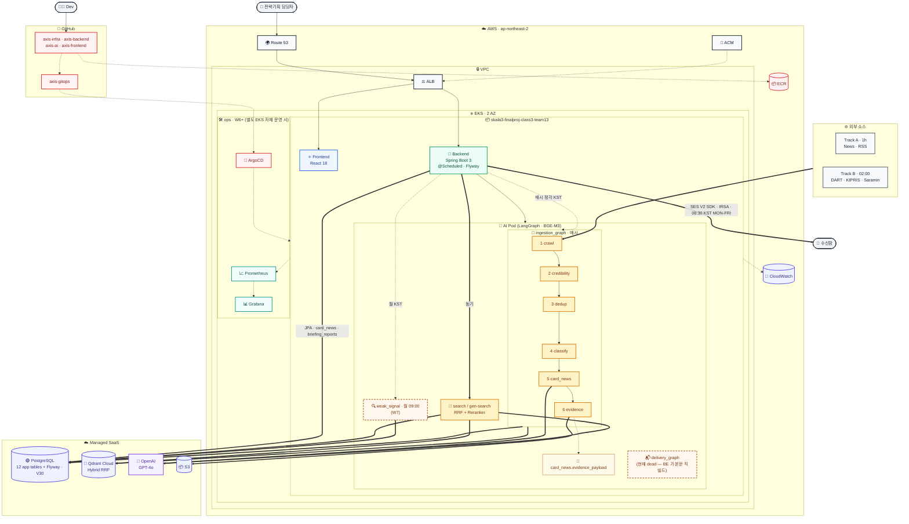

# AXIS 시스템 아키텍처

> Figma 작업용 단일 레퍼런스. **이 문서가 SoT** — 인프라·파이프라인 변경 시 함께 갱신.
> 작성: 2026-04-30 · 갱신: 2026-05-19 (V30 최소 DB 스키마 / legacy archive 보존 / 화면별 read model 반영) · 적용 범위: axis-infra / axis-backend / axis-ai / axis-frontend
>
> 한 캔버스에 인프라 토폴로지 + AI Pod 내부 동작 동시 표현. 저장소·SaaS 는 한 번만 등장.
>
> 실선 = 현재 docker-compose · 점선 = W6+ K8s/ArgoCD/모니터링 계획.

---

## 1. 한 장 시스템 아키텍처



### 1.1 다이어그램 범례

| 선 종류 | 의미 | 사용 예 |
|---|---|---|
| `─→` 실선 | 사용자 요청 트래픽 · in-cluster HTTP · LangGraph 노드 간 흐름 | User→R53→ALB→BE→AI, ingestion 6노드 시퀀스 |
| `═→` 굵은 실선 | 외부 fetch · 데이터 영속화 · LLM 호출 · 알림 발송 · 동기 위임 | SOURCES→crawl, ING→Supabase INSERT, ING→Qdrant upsert, search→OpenAI, delivery→Mail, BE→search 동기 위임 |
| `-.→` 점선 | BE @Scheduled 트리거 · graph 내부 부수 효과 · CI/CD · 모니터링 (W6+ 계획) | BE→ingestion/delivery/weak_signal 트리거, evidence→Evidence Chain 생성, ACM→ALB cert, GH→ArgoCD, Pods→Prometheus |

### 1.2 AI Pod 의 4개 실행 단위 — 구현 형태별 분리

같은 AI Pod 에서 실행되지만 **구현 형태가 다름**. 실행 주기·동기성이 다른 작업은 같은 그래프/모듈에 묶지 않음 (ADR-0004 파이프라인 분리). 단위 간 통신은 오직 PostgreSQL 을 통해서만.

| 단위 | 구현 | 트리거 | 결과물 | 시간 예산 |
|---|---|---|---|---|
| `ingestion_graph.py` | LangGraph 6노드 | BE `@Scheduled.triggerIngestionPipeline` → `/pipeline/run` · 매시 정각 KST (`AXIS_SCHEDULER_ENABLED=true`) | `card_news` + `card_news.evidence_payload` + `card_news.image_assets` | 30초 / cycle |
| **(BE 직빌드) BriefingService** | Java (axis-backend) — sector-grouped HTML/text 빌더 + `SesMailService` SES V2 SDK | BE `@Scheduled.sendDailyBriefing` · `cron="0 30 8 * * MON-FRI" zone="Asia/Seoul"` | `card_news` SELECT → SES 발송 (messageId) → `briefing_reports.delivery_history` | 5초 |
| `delivery_graph.py` (**현재 dead**) | LangGraph 1노드 (build_briefing_node) | (호출자 없음 — `AiClientService.buildBriefing` 정의됐으나 미사용) | (의도: BE 가 cards 보내면 HTML/text 본문 반환) | 5초 |
| `rag/` (search) | RAG 모듈 — embedder + hybrid_search + reranker (graph 아님) | User `POST /api/search` → BE → `/search` · `/gen-search` | 검색 응답 / Generative Search (SC 3회) | 10초 (BE 타임아웃) |
| `weak_signal` | **W7 구현 예정** — `weak_signal_graph.py` 신규 + `_deprecated/weak_signal_agent.py` 재구축 | BE `@Scheduled` `/weak-signal/run` · 월 09:00 | `signal_cards` *(테이블 미존재 — W7 추가 예정)* | 60초 |

### 1.3 인프라 설계 결정사항

| 결정 | 선택 | 이유 |
|---|---|---|
| **클러스터 수** | SKALA 공유 K8s 1개 — 단일 namespace `skala3-finalproj-class3-team13` (별도 namespace 생성 금지) | 발주처 정책. 자체 EKS 띄울 시에만 ops namespace 추가 (W6+) |
| **AZ 수** | 2 AZ (a, c) | 30명 사용자에 3 AZ 는 과잉. RDS 가 Supabase managed 이므로 stateful 부담 없음 |
| **CI/CD** | GitHub Actions + ArgoCD (Jenkins 채택 안 함) | GH Actions 가 이미 4 레포 모두에 동작 중. Jenkins 도입은 학습 외 실익 없음 |
| **모니터링** | Prometheus + Grafana + CloudWatch Logs (Loki 채택 안 함) | EKS 컨트롤플레인 로그가 이미 CWL 로 가니 Loki 중복. 메트릭만 자체 운영 |
| **모델 추적** | (없음) — MLflow 도입 안 함 | 미세조정·자체 모델 학습 없음. BGE-M3·GPT-4o 모두 외부. 실험은 수기 노트로 충분 |
| **로드밸런서** | AWS ALB + K8s Service (NodePort/ClusterIP) | AWS LB Controller 로 Ingress 자동 프로비저닝. 별도 NGINX Ingress 불필요 |
| **시크릿** | AWS Secrets Manager → External Secrets Operator | `.env` 직접 마운트 금지 (보안 컨벤션) |
| **알림 채널** | 이메일 — **AWS SES V2 SDK + IRSA** (axis-backend `SesMailService`), sender `noreply@skala-ai.com`. Slack/SMTP 폐기 (v3 → v4) | SK AX 사업전략팀 운영 환경과 일치 (ADR-0008) |

### 1.4 Known cleanup items (P9)

ADR-0008 spec(CronJob → BE → axis-ai 본문빌더) 과 실 구현(BE @Scheduled → BE Java 직빌드) 이 갈렸음. 발표 후 둘 중 하나로 통일.

| 항목 | 현 상태 | 영향 | 권장 |
|---|---|---|---|
| `axis-cron-delivery` CronJob | 08:30 KST 매일 발사 → `POST /api/pipeline/delivery` (endpoint 미구현) → 500 → backoffLimit 소진 후 ignored | 매일 실패 job 1건 생성, kubectl 노이즈 | **삭제** (Spring `@Scheduled.sendDailyBriefing` 가 이미 동일 시각에 정상 동작) |
| `axis-cron-ingestion-a/b/c` CronJob | 정상 동작 (BE `/api/pipeline/trigger` 호출). 단 Spring `@Scheduled.triggerIngestionPipeline` 와 동시 발사 시 **이중 ingestion** | 매시 ingestion 2회 실행 가능, LLM 비용 2배 | **삭제** 또는 Spring `@Scheduled` 측 비활성. 단일 트리거 정책 결정 필요 |
| `axis-ai delivery_graph.py` + `/pipeline/delivery` | 코드 존재, 호출자 없음 (`AiClientService.buildBriefing` 정의는 있으나 미사용) | dead code | (a) 삭제 또는 (b) BE 가 본문 빌더 위임하도록 통합 |
| AWS SDK V2 STS 의존성 | `build.gradle` 에 명시적 추가 완료. SDK 가 transitively 안 가져옴 — IRSA 필수 | 안 박으면 `WebIdentityTokenCredentialsProvider: 'sts' module must be on classpath` 런타임 실패 | **유지** (코드에 주석 박혀있음) — 다른 IRSA 도입 서비스에도 동일 필요 |
| `application-prod.yml` logging | `com.skala.axis: WARN` baseline + `SesMailService/BriefingService/SchedulerConfig` INFO uplift | 운영 추적 OK (messageId 가시화). 다른 INFO 는 묻힘 | **유지** — 새 운영-중요 클래스 생기면 같은 패턴으로 추가 |

---

## 2. 컴포넌트 스택 (한 페이지 요약)

| 레이어 | 기술 | 책임 | 현재 상태 |
|---|---|---|---|
| Frontend | React 18 + Vite + TypeScript + Radix UI | 대시보드 UI | **SKALA EKS 운영 배포 중** (ALB ingress, GitOps) |
| Backend | Spring Boot 3.x · Java 17 · Flyway · WebClient · **AWS SES V2 SDK + STS module** (IRSA 필수) | REST API · JWT · 스케줄러 · 이메일 브리핑 (SES IRSA) · 수동 트리거 `POST /api/pipeline/briefing` | 평일 08:30 KST 자동 발송 — Spring `@Scheduled` `zone="Asia/Seoul"` → `BriefingService.generateAndSend()` → `SesMailService` → SES. **2026-05-12 end-to-end 검증 완료** (messageId 발급 + 6명 inbox 도착) |
| AI Server | Python 3.11 · FastAPI · LangGraph 1.1.8 · uv | 4개 graph (ingestion / delivery / search / weak_signal) | SQLAlchemy 2.0 + psycopg2 로 PostgreSQL 접근 |
| Pipeline 노드 | crawl · credibility · dedup · classify · card_news · evidence | 6노드 LangGraph + 결정적 노출도 산식 | `axis-ai/src/pipeline/ingestion_graph.py` |
| Evidence Payload | source_links · provenance · financial_refs · mbb_refs | 환각 방지 검증 첨부 4종 | `card_news.evidence_payload` |
| RDB | PostgreSQL 16 (EKS PostgreSQL / Flyway 관리) | **12 앱 테이블 + 1 Flyway 관리 테이블 + 2 views (V30 기준)** — Product ERD는 Core Content · Card Output · Briefing · Mixer · Insight · Global Industry 중심. `raw_articles` 원문과 `market_price_ohlcv` 주가 row는 보존하고, 제거된 레거시 테이블은 `legacy_records`에 row 단위 archive. | namespace `skala3-finalproj-class3-team13`, service `postgres:5432` |
| Vector DB | Qdrant 1.9 (Cloud) | Hybrid RRF (Dense + Sparse) | `axis_main` 3개월 · `axis_history` 12개월 TTL |
| LLM | OpenAI GPT-4o | 분류 · 카드 생성 · Generative Search | 일일 비용 목표 ≤ ₩5,000 |
| 임베딩 / 재랭킹 | BGE-M3 + BGE-reranker-v2-m3 (FlagEmbedding 1.x, MIT) | AI Pod 내장 — 외부 호출 없음 | Dense+Sparse 원샷 추론 |
| 스케줄러 | Spring `@Scheduled` (cron) — **`AXIS_SCHEDULER_ENABLED=true` 로 활성** | 매시 정각 수집 · 평일 08:30 KST 브리핑 (`zone="Asia/Seoul"`) · 월 09:00 약한신호 | `SchedulerConfig.java`. CronJob 4종 (`axis-cron-ingestion-a/b/c`, `axis-cron-delivery`) 과 트리거 중복 — 정리 항목 §1.4 참조 |
| 컨테이너 | **SKALA EKS** (Docker Compose 는 로컬 개발만) | 5 Deployment + 4 CronJob + 3 PVC + Ingress | namespace `skala3-finalproj-class3-team13`, cluster `skala-2025` |
| 이미지 레지스트리 | **Harbor** (`amdp-registry.skala-ai.com/skala26a-ai3`) | git SHA tag + `:develop` + `:buildcache` | linux/amd64 강제 |
| CI | GitHub Actions | 빌드 · 테스트 · 이미지 푸시 → Harbor | 4 레포 각각 동작 (Jenkins 도입 안 함) |
| CD | **공용 SKALA ArgoCD** (`skala-argocd`) | GitOps · `axis-infra` develop watch | UI: argocd.skala25a.project.skala-ai.com (P6 rollback drill 검증) |
| 모니터링 | (없음) → Prometheus + Grafana + CloudWatch Logs | 메트릭 + 로그 (Loki·MLflow 도입 안 함) | **P8 계획** (발표 후) |

> ADR 참조: [SpringBoot](adr/0001-springboot-selection.md) · [Qdrant](adr/0002-qdrant-selection.md) · [BGE-M3](adr/0003-bge-m3-selection.md) · [파이프라인 분리](adr/0004-pipeline-separation.md) · [이중 저장소](adr/0005-two-storage-design.md) · [Flyway](adr/0006-flyway-introduction.md) · [공용 ArgoCD GitOps](adr/0007-cicd-shared-argocd.md) · [AWS SES IRSA](adr/0008-email-aws-ses-irsa.md)

---

## 3. Figma 작업 가이드

### 3.1 캔버스 레이아웃

> 한 캔버스에 모든 컴포넌트를 배치. AI Pod 가 캔버스 중앙에서 가장 큰 박스 (LangGraph 4 graphs 가 안에 들어가니 자연스럽게 면적 최대) — AXIS 가치의 90% 가 여기서 나오는 걸 시각적 비율로 강조.

```text
┌─ AXIS System Architecture (한 장 통합) ─────────────────────────────────────┐
│                                                                            │
│  👤 User ──→ 🌍 Route 53 ──→ ⚖️ ALB                  👨‍💻 Dev ──→ 🐙 GitHub │
│                              │                                  │          │
│                              ▼                                  ▼          │
│  ┌─ ☁️ AWS · ap-northeast-2 ──── 🔒 VPC ─────────────────┐  📦 ECR         │
│  │   ⎈ EKS · 2 AZ (a · c)                                │                 │
│  │   ┌─ 📦 skala3-finalproj-class3-team13 ────────────┐  │                 │
│  │   │                                                │  │                 │
│  │   │  ⚛️ FE Pod         🍃 BE Pod (@Scheduled)     │  │                 │
│  │   │                       │                        │  │                 │
│  │   │     ┌─ 🐍 AI Pod ──── ▼ ────────────────────┐  │  │                 │
│  │   │     │                                       │  │  │                 │
│  │   │     │  🔄 ingestion_graph (매시 정각)        │  │  │                 │
│  │   │     │  1·crawl → 2·cred → 3·dedup           │  │  │                 │
│  │   │     │     → 4·classify → 5·card → 6·evid    │  │  │                 │
│  │   │     │     └─ 📎 Evidence Chain 4종 ─┘       │  │  │                 │
│  │   │     │                                       │  │  │                 │
│  │   │     │  📬 delivery_graph (평일 08:30)        │  │  │                 │
│  │   │     │  🔎 search_graph (동기)                │  │  │                 │
│  │   │     │  🔍 weak_signal_graph (월 09:00)       │  │  │                 │
│  │   │     └───────────────────────────────────────┘  │  │                 │
│  │   └────────────────────────────────────────────────┘  │                 │
│  │   ┌─ 🛠️ ops (자체 EKS 시) · W6+ ─┐                       │                 │
│  │   │ 🐙 ArgoCD · 📈 Prom · 📊 Grafana                   │                 │
│  │   └──────────────────────┘                            │                 │
│  └────────────────────────────────────────────────────────┘                 │
│                                                                            │
│  ── 외부 데이터 ──            ── Managed SaaS (한 번만) ──   ── 알림 ──     │
│  🌐 Track A · B · C    🟢 Supabase  🔴 Qdrant  🤖 OpenAI  📦 S3   📧 Mail │
│                                                                            │
└────────────────────────────────────────────────────────────────────────────┘
```

### 3.2 Frame · 색상 · 로고

**Frame**: 1920×1080 (또는 4K 발표용 3840×2160). AI Pod 박스가 캔버스 가운데 ~50% 면적 차지하도록.

**색상 팔레트** (다이어그램 그룹별)

| 그룹 | 배경 | 보더 | 용도 |
|---|---|---|---|
| User / 외부 | `#F3F4F6` | `#1F2937` | User · Developer · Email · 외부 데이터 소스 |
| Frontend | `#EFF6FF` | `#2563EB` | React 영역 |
| Backend | `#ECFDF5` | `#059669` | Spring Boot · BriefingAgent (delivery) |
| AI / Pipeline | `#FEF3C7` | `#D97706` | AI Pod · LangGraph 4 graphs · 7 nodes |
| Evidence Chain | `#FFFBEB` | `#B45309` | 검증 첨부 4종 (AI 보다 옅게) |
| 저장소 | `#EEF2FF` | `#4F46E5` | Supabase · Qdrant · S3 · CloudWatch |
| LLM SaaS | `#F5F3FF` | `#7C3AED` | OpenAI GPT-4o |
| CI/CD | `#FEF2F2` | `#DC2626` | GitHub Actions · ArgoCD · ECR |
| 모니터링 | `#F0FDFA` | `#0D9488` | Prometheus · Grafana |
| AWS Cloud | `#F8FAFC` | `#0F172A` | VPC · ALB · Region 박스 |

**로고 SVG** (Figma `Iconify` 플러그인에서 ID 검색해 끌어다 쓰면 됨)

| 컴포넌트 | Iconify ID | 브랜드 컬러 |
|---|---|---|
| React | `logos:react` | `#61DAFB` |
| Vite | `logos:vitejs` | `#646CFF` |
| TypeScript | `logos:typescript-icon` | `#3178C6` |
| Spring Boot | `logos:spring-icon` | `#6DB33F` |
| Java | `logos:java` | `#007396` |
| Python | `logos:python` | `#3776AB` |
| FastAPI | `logos:fastapi-icon` | `#009688` |
| LangChain / LangGraph | `simple-icons:langchain` | `#1C3C3C` |
| OpenAI | `simple-icons:openai` | `#412991` |
| Hugging Face (BGE-M3) | `logos:hugging-face-icon` | `#FFD21E` |
| PostgreSQL | `logos:postgresql` | `#4169E1` |
| Supabase | `logos:supabase-icon` | `#3ECF8E` |
| Qdrant | `simple-icons:qdrant` | `#DC382D` |
| Docker | `logos:docker-icon` | `#2496ED` |
| Kubernetes | `logos:kubernetes` | `#326CE5` |
| ArgoCD | `logos:argo-icon` | `#EF7B4D` |
| GitHub | `logos:github-icon` | `#181717` |
| GitHub Actions | `logos:github-actions` | `#2088FF` |
| AWS | `logos:aws` | `#FF9900` |
| Prometheus | `logos:prometheus` | `#E6522C` |
| Grafana | `logos:grafana` | `#F46800` |
| Naver | (텍스트 라벨) | `#03C75A` |

### 3.3 작업 팁

1. **컴포넌트 라이브러리 먼저** — Pipeline Node Box(rounded 12px, 보더 2px, 좌상단 번호 뱃지), Cloud Boundary(점선 박스), Storage Cylinder, 화살표 4종(실선/굵은실선/점선/엣지라벨용 곡선) 을 라이브러리화
2. **AI Pod 박스가 가장 크게** — AI Pod 안에 LangGraph 4 graphs nested. AXIS 의 차별점이라 공간 가장 많이 할당 (캔버스 ~50%)
3. **ingestion_graph 의 7노드는 가로 시퀀스** — 좌→우 7노드 박스 + 화살표. 노드 번호는 보더 컬러 원 + 흰 숫자
4. **Evidence Chain 4종은 evidence(6) 노드에서 분기** — 옅은 보더 (`#B45309`) 로 묶어 "여기에 환각 방지 장치가 있다" 시각적 강조. ingestion_graph 박스 안 또는 바로 옆
5. **delivery / search / weak_signal 은 압축 박스** — 각 한 박스에 노드 시퀀스를 한두 줄 텍스트로 (ingestion 의 디테일 보존, 다른 graph 는 라벨만)
6. **점선 보더 박스** — ops namespace (자체 EKS 시) 와 CI/CD 흐름은 `[6, 4]` dash, 보더 컬러 `#94A3B8`. "현재 미구축, W6+" 가 한눈에 보이게
7. **트래픽 흐름은 두께·색으로 구분**
   - 사용자 (파랑 실선) / 영속화·외부 fetch (보라 굵은 실선) / @Scheduled 트리거 (회색 점선) / CI/CD (주황 점선) / 모니터링 (청록 점선)
8. **외부 SaaS 는 Cloud 박스 밖으로** — Supabase / Qdrant / OpenAI / S3 를 VPC 박스 외부 하단에 별도 zone 으로. 캔버스 한 번만 등장 ("우리 인프라가 아님" + 중복 제거)
9. **트래픽·비용 캡션 우하단** — 작은 글씨로:

   | 항목 | 추정치 | 근거 |
   |---|---|---|
   | 활성 사용자 | ~30명 (사내) | SK AX 사업전략팀 규모 |
   | 일일 크롤링 | ~500건 | Naver·DART·RSS·Saramin 합산 |
   | Qdrant upsert | ~50건/일 | Gate 1·2·3 통과 후 |
   | LLM 비용 | 목표 ≤ ₩5,000/일 | infra/CLAUDE.md 성능 목표 |
   | 카드뉴스 E2E | 목표 ≤ 30초 | 4주차 목표 |
   | RAG Hit@5 | 목표 ≥ 0.90 | 5주차 목표 |

---

## 부록: Mermaid → SVG 내보내기

```bash
# CLI 설치
npm install -g @mermaid-js/mermaid-cli

# 본 문서의 §1 mermaid 블록을 SVG 로 (Figma import 용)
mmdc -i docs/SYSTEM_ARCHITECTURE.md -o docs/architecture.svg
```

또는 [mermaid.live](https://mermaid.live) 에 §1 코드 그대로 붙여넣고 다운로드.

---

## 갱신 정책

- **언제**: 새 컴포넌트 / 외부 의존 / 배포 토폴로지 / 파이프라인 노드 추가·삭제 시
- **누가**: 변경 도입 PR 작성자가 같은 PR 에 본 문서 diff 포함
- **검증**: 리뷰어가 다이어그램 ↔ 실제 매니페스트·`*_graph.py` 정합성 확인
- **ADR 와 관계**: 큰 의사결정은 ADR 가 SoT, 본 문서는 시각화. ADR 변경 시 본 문서도 동시 갱신
