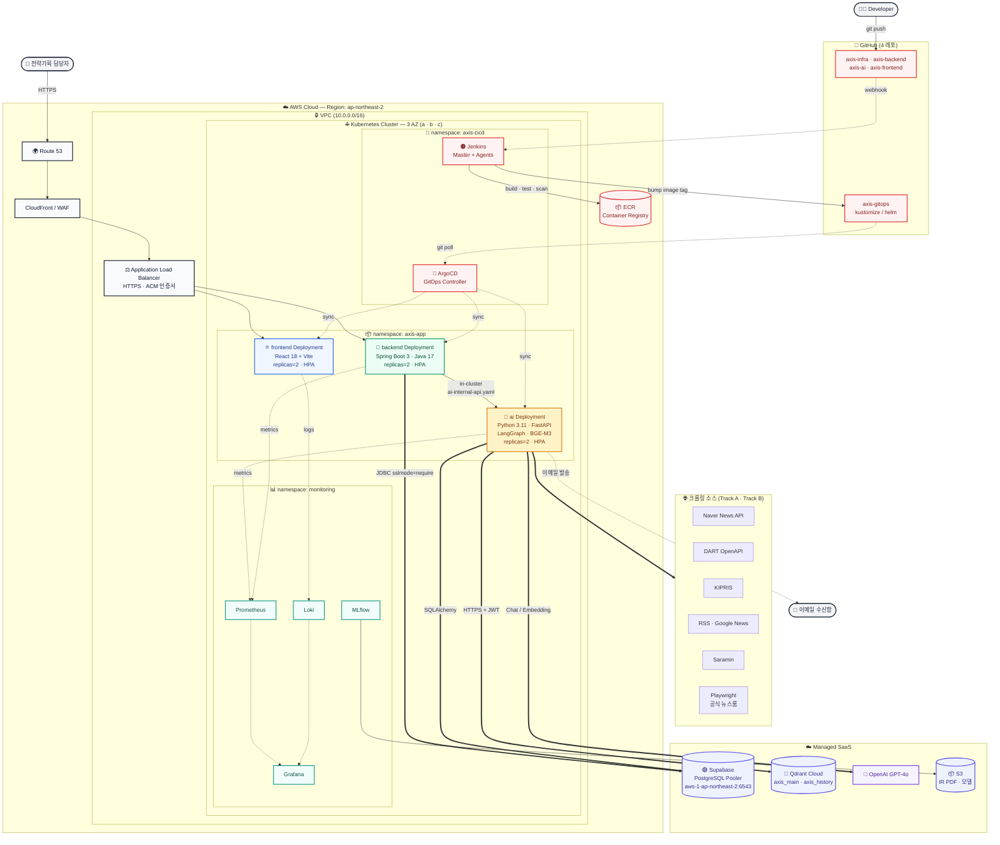

# AXIS 시스템 아키텍처

> Figma 작업용 단일 레퍼런스. **이 문서가 SoT** — 인프라 변경 시 함께 갱신.
> 작성: 2026-04-30 · 적용 범위: axis-infra / axis-backend / axis-ai / axis-frontend
> 표현 방식: 한 장 통합 다이어그램(현재 + K8s + CI/CD 미래상 모두 반영)

---

## 1. 한 장 시스템 아키텍처



### 다이어그램 범례

| 선 종류 | 의미 |
|---|---|
| `─→` 실선 | 사용자 요청 트래픽 (동기 HTTP) |
| `═→` 굵은 실선 | 데이터 영속화 / 외부 LLM 호출 |
| `-.→` 점선 | CI/CD 배포 흐름 · 모니터링 메트릭 (비동기) |

---

## 2. 컴포넌트 스택 (한 페이지 요약)

| 레이어 | 기술 | 책임 | 비고 |
|---|---|---|---|
| Frontend | React 18 + Vite + TypeScript + Radix UI | 대시보드 UI | replicas=2, HPA cpu 70% |
| Backend | Spring Boot 3.x + Java 17 + Flyway 9 | REST API · JWT · 스케줄러 · 이메일 | replicas=2, HPA cpu 70% |
| AI Server | Python 3.11 + FastAPI + LangGraph 1.1 + uv | 크롤링 · 7노드 분석 파이프라인 · RAG | replicas=2, HPA cpu 80% |
| RDB | PostgreSQL 16 (Supabase Managed) | 원문 · 이슈카드 · evidence_chain | Transaction Pooler:6543 |
| Vector DB | Qdrant 1.9 (Cloud) | 하이브리드 검색 (Dense+Sparse RRF) | `axis_main` 3M / `axis_history` 12M TTL |
| LLM | OpenAI GPT-4o | 분류 · 카드 · Generative Search | 일평균 ~₩2,150 |
| 임베딩 / 재랭킹 | BGE-M3 + BGE-reranker-v2-m3 | 로컬 추론 (FlagEmbedding) | AI Pod 내장 |
| 컨테이너 | Docker → Kubernetes | 5 컨테이너 → K8s Deployment | 현재 docker-compose, W6+ K8s |
| CI | GitHub Actions → Jenkins | 빌드 · 테스트 · 이미지 push | Jenkins on K8s (axis-cicd ns) |
| CD | (수동) → ArgoCD | GitOps · 무중단 배포 | `axis-gitops` 레포 watch |
| 모니터링 | MLflow + Prometheus + Grafana + Loki | 모델 실험 · 서비스 메트릭 · 로그 | `monitoring` namespace |

> ADR 참조: [SpringBoot](adr/0001-springboot-selection.md) · [Qdrant](adr/0002-qdrant-selection.md) · [BGE-M3](adr/0003-bge-m3-selection.md) · [파이프라인 분리](adr/0004-pipeline-separation.md) · [이중 저장소](adr/0005-two-storage-design.md) · [Flyway](adr/0006-flyway-introduction.md)

---

## 3. Figma 작업 가이드

### 3.1 전체 레이아웃 (스크린샷 1번 패턴 차용)

```
┌────────────────────────────────────────────────────────────────────────────┐
│  👤 User ──→ Route 53 ──→ CloudFront ──→ ALB              👨‍💻 Developer    │
│                                                              ↓             │
│                                                            GitHub          │
├────────────────────────────────────────────────────────────────────────────┤
│  ☁️ AWS Cloud — Region ap-northeast-2                                       │
│  ┌──────────────────────────────────────────────────────────────────────┐ │
│  │ 🔒 VPC                                                                │ │
│  │  ┌──────────── ⎈ Kubernetes Cluster (가로로 길게) ──────────────┐    │ │
│  │  │  AZ-a 컬럼          AZ-b 컬럼          AZ-c 컬럼              │    │ │
│  │  │  ┌────────────┐    ┌────────────┐    ┌────────────┐         │    │ │
│  │  │  │ Public     │    │ Public     │    │ Public     │         │    │ │
│  │  │  │  ALB·NAT   │    │  NAT       │    │  NAT       │         │    │ │
│  │  │  ├────────────┤    ├────────────┤    ├────────────┤         │    │ │
│  │  │  │ Private    │    │ Private    │    │ Private    │         │    │ │
│  │  │  │  FE·BE·AI  │    │  FE·BE·AI  │    │  Jenkins   │         │    │ │
│  │  │  │            │    │            │    │  ArgoCD    │         │    │ │
│  │  │  │            │    │            │    │  MLflow    │         │    │ │
│  │  │  └────────────┘    └────────────┘    └────────────┘         │    │ │
│  │  └──────────────────────────────────────────────────────────────┘    │ │
│  │                              ECR (Container Registry)                  │ │
│  └──────────────────────────────────────────────────────────────────────┘ │
└────────────────────────────────────────────────────────────────────────────┘
   ┌──────────────┐  ┌──────────────┐  ┌──────────────┐  ┌──────────────┐
   │ 🟢 Supabase  │  │ 🔴 Qdrant    │  │ 🤖 OpenAI    │  │ 📦 S3         │
   │ PostgreSQL   │  │ Cloud        │  │ GPT-4o       │  │ Storage      │
   └──────────────┘  └──────────────┘  └──────────────┘  └──────────────┘
                              ↑
   ┌──────────────────────────────────────────────────────────┐
   │ 🌐 외부 크롤 소스: Naver · DART · KIPRIS · RSS · Saramin  │
   └──────────────────────────────────────────────────────────┘
```

### 3.2 Frame · 색상 · 로고

**Frame**: 1920×1080 (또는 4K 발표용 3840×2160)

**색상 팔레트** (다이어그램 그룹별)

| 그룹 | 배경 | 보더 | 용도 |
|---|---|---|---|
| User / 외부 | `#F3F4F6` | `#1F2937` | User · Developer · Email |
| Frontend | `#EFF6FF` | `#2563EB` | React 영역 |
| Backend | `#ECFDF5` | `#059669` | Spring Boot |
| AI | `#FEF3C7` | `#D97706` | Python AI 서버 |
| 저장소 | `#EEF2FF` | `#4F46E5` | DB · S3 |
| LLM SaaS | `#F5F3FF` | `#7C3AED` | OpenAI |
| CI/CD | `#FEF2F2` | `#DC2626` | Jenkins · ArgoCD · ECR |
| 모니터링 | `#F0FDFA` | `#0D9488` | Prometheus · Grafana · MLflow |
| AWS Cloud | `#F8FAFC` | `#0F172A` | VPC · ALB · Region 박스 |

**로고 SVG** (Figma `Iconify` 플러그인에서 ID 검색해 끌어다 쓰면 됨)

| 컴포넌트 | Iconify ID | 브랜드 컬러 |
|---|---|---|
| React | `logos:react` | `#61DAFB` |
| Vite | `logos:vitejs` | `#646CFF` |
| TypeScript | `logos:typescript-icon` | `#3178C6` |
| Spring Boot | `logos:spring-icon` | `#6DB33F` |
| Java | `logos:java` | `#007396` |
| Python | `logos:python` | `#3776AB` |
| FastAPI | `logos:fastapi-icon` | `#009688` |
| LangChain | `simple-icons:langchain` | `#1C3C3C` |
| OpenAI | `simple-icons:openai` | `#412991` |
| Hugging Face (BGE-M3) | `logos:hugging-face-icon` | `#FFD21E` |
| PostgreSQL | `logos:postgresql` | `#4169E1` |
| Supabase | `logos:supabase-icon` | `#3ECF8E` |
| Qdrant | `simple-icons:qdrant` | `#DC382D` |
| Docker | `logos:docker-icon` | `#2496ED` |
| Kubernetes | `logos:kubernetes` | `#326CE5` |
| Jenkins | `logos:jenkins` | `#D24939` |
| ArgoCD | `logos:argo-icon` | `#EF7B4D` |
| GitHub | `logos:github-icon` | `#181717` |
| AWS | `logos:aws` | `#FF9900` |
| MLflow | `simple-icons:mlflow` | `#0194E2` |
| Prometheus | `logos:prometheus` | `#E6522C` |
| Grafana | `logos:grafana` | `#F46800` |
| Naver | (텍스트 라벨) | `#03C75A` |

### 3.3 작업 팁

1. **컴포넌트 라이브러리 먼저** — Server Box(rounded 12px, 보더 2px), Database Cylinder, Cloud Boundary(점선 박스), 화살표(실선=동기 / 점선=비동기) 4종을 라이브러리로 만들어두면 양산 빠름
2. **AZ 점선 박스** — 첫 번째 스크린샷처럼 dash `[6, 4]`, 보더 컬러 `#94A3B8`
3. **K8s 박스가 3 AZ를 가로지르게** — Pod 들이 AZ 어디든 떠도 됨을 시각적으로 표현 (스크린샷의 "Kubernetes Engine" 박스 패턴)
4. **트래픽 흐름은 두께·색으로 구분** — 사용자 요청(파랑 실선) / 데이터 영속화(녹색 굵은 실선) / CI/CD(주황 점선) / 모니터링(회색 점선)
5. **외부 SaaS 는 Cloud 박스 밖으로** — 시각적으로 "우리 인프라 외부" 임을 명확히 (스크린샷에서 elastic/MongoDB/weaviate 가 하단에 별도)
6. **트래픽·비용 캡션 우하단** — 첫 번째 스크린샷처럼 월간 사용자 / API 호출량 / LLM 비용 추정치 작은 글씨로

---

## 부록: Mermaid → SVG 내보내기

```bash
# CLI 설치
npm install -g @mermaid-js/mermaid-cli

# 본 문서의 mermaid 블록을 SVG 로 (Figma import 용)
mmdc -i docs/SYSTEM_ARCHITECTURE.md -o docs/architecture.svg
```

또는 [mermaid.live](https://mermaid.live) 에 §1 코드 그대로 붙여넣고 다운로드.

---

## 갱신 정책

- **언제**: 새 컴포넌트 / 외부 의존 / 배포 토폴로지 변경 시
- **누가**: 변경 도입 PR 작성자가 같은 PR 에 본 문서 diff 포함
- **검증**: 리뷰어가 다이어그램 ↔ 실제 매니페스트 정합성 확인
- **ADR 와 관계**: 큰 의사결정은 ADR 가 SoT, 본 문서는 시각화. ADR 변경 시 본 문서도 동시 갱신
